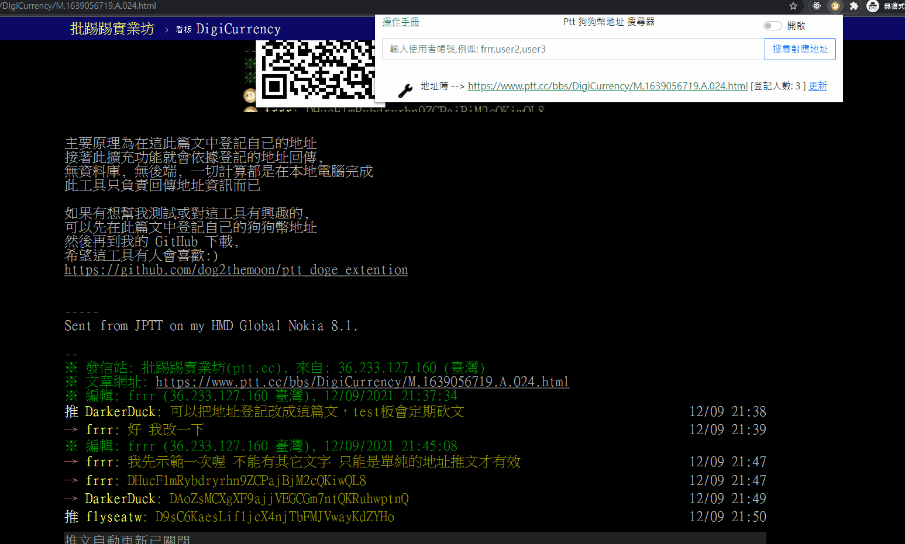
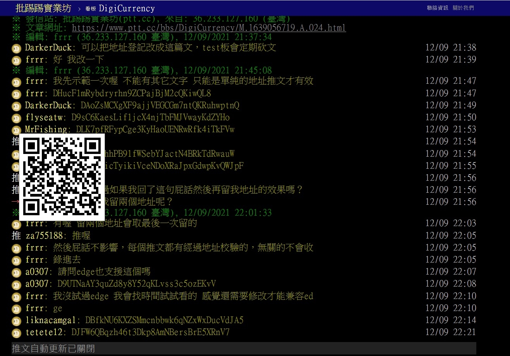
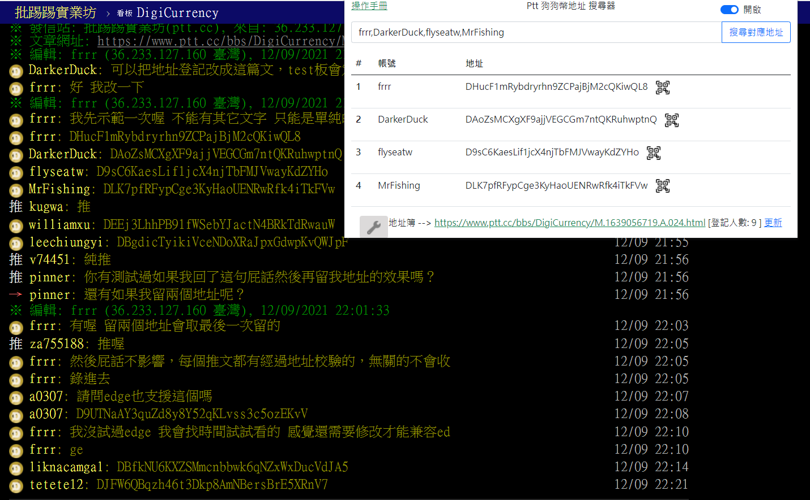

# 台灣Ptt論壇專屬的 狗狗幣地址搜尋器
標準的地址簿設定: (請在擴充功能中設定以下連結)

`https://www.ptt.cc/bbs/DigiCurrency/M.1639056719.A.024.html`

此Google擴充功能僅會將有在地址簿留言的人加入清單

趕快到以上的地址簿連結推文, 登記自己的狗狗幣地址吧!

`注意: 如果重複登記地址, 則系統會採用最後一次的登記地址`

## 關於
此應用目的是,讓Ptt論壇中的所有人, 
方便的搜尋到, 
Ptt使用者的狗狗幣地址。

[影片 Demo](https://www.youtube.com/watch?v=_QHaZa7bfBs)

## 如何安裝
目前已經上架到Google 擴充商店中了, [下載連結在此](https://chrome.google.com/webstore/detail/ptt-%E7%8B%97%E7%8B%97%E5%B9%A3%E5%9C%B0%E5%9D%80-%E6%9F%A5%E8%A9%A2%E5%99%A8/acpcdgdhccpllbnaelmhmnokifgojnhl)

以下為另一種安裝方式, 可體驗到最新未發布的版本:

1. 直接下載此專案後, 將專案資料夾解壓縮
2. 進入 chrome://extensions/
3. 把右上角的開發人員選項打開
4. 點選`載入未封裝項目`, 選擇剛才解壓縮的資料夾即可
如圖: 

## 如何使用
先在擴充功能的地址簿設定中設定以下連結:

`https://www.ptt.cc/bbs/DigiCurrency/M.1639056719.A.024.html`

之後只要到 https://www.ptt.cc/bbs/index.html 網站下
點開任何一篇文章時,
都會標註地址在有登記地址簿的使用者ID旁,

可先到此網頁測試, 祝使用愉快 :)

https://www.ptt.cc/bbs/DigiCurrency/M.1639056719.A.024.html

